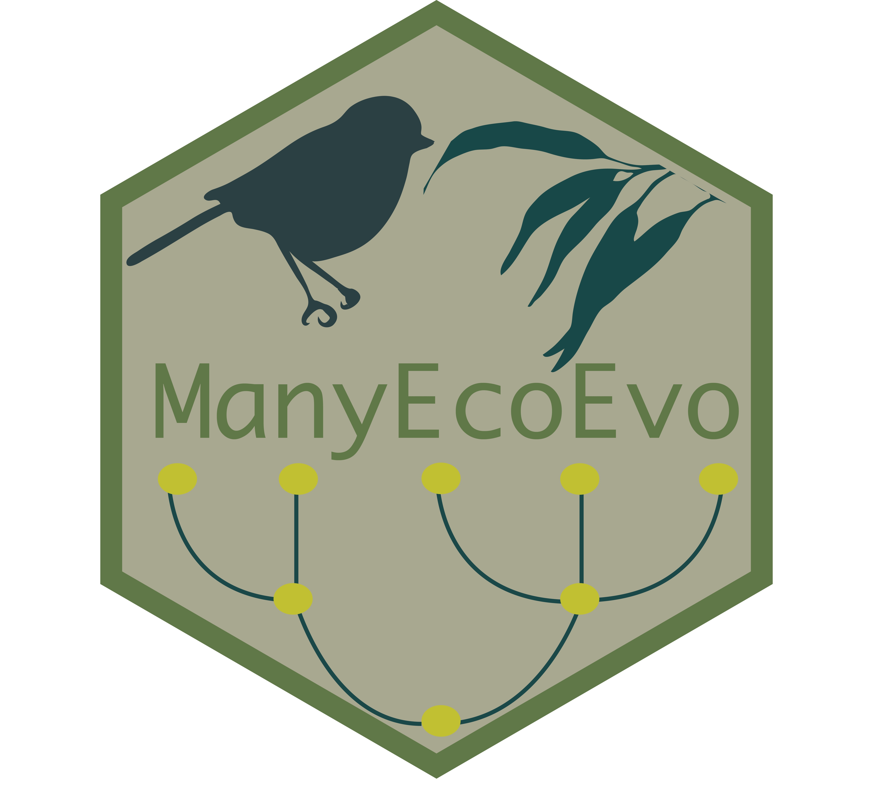

# Source Code for the ManyEcoEvo Manuscipt 

This repository contains the source code for generating the ManyEcoEvo
Manuscript *“Same data, different analysts: variation in effect sizes
due to analytical decisions in ecology and evolutionary biology.”*[^1]

The data primary analysis code and pipeline is stored and executed in
the R package `ManyEcoEvo::`, located at
<https://doi.org/10.5281/zenodo.10046153> or
<https://github.com/egouldo/ManyEcoEvo>.

# Reproducing the manuscript on your machine

1.  Clone or download and unzip this repository
2.  Open the `ManyAnalysts.Rproj` file in RStudio
3.  Install `renv::` and Run `renv::restore()` to load the packages used
    in this repository locally on your machine (see
    [renv::](https://rstudio.github.io/renv/index.html) for details).
    Follow the prompts, and if `ManyEcoEvo::` does not install, install
    it with: \`devtools::install_github(“egouldo/ManyEcoEvo”).
4.  In the console, run `quarto::quarto_render()`, output will be
    created in `_book/index.html`.

# License 

The code in this repository is licensed with the GNU GPL 3 license.

# Contributing

Should you find any mistakes or errors, please lodge a GitHub issue at
<https://github.com/egouldo/ManyAnalysts/issues>. This repository is
released with a [Contributor Code of
Conduct](https://github.com/egouldo/ManyAnalysts/blob/6a2585fb9225575a97ed87033ad57aa095f23170/CODE_OF_CONDUCT.md)
.

[^1]: Gould, E., Fraser, H., Parker, T. *et al.* (2023). Same data,
    different analysts: Variation in effect sizes due to analytical
    decisions in ecology and evolutionary biology \[Preprint\]. Ecology
    and Evolutionary Biology. https://doi.org/10.32942/X2GG62
